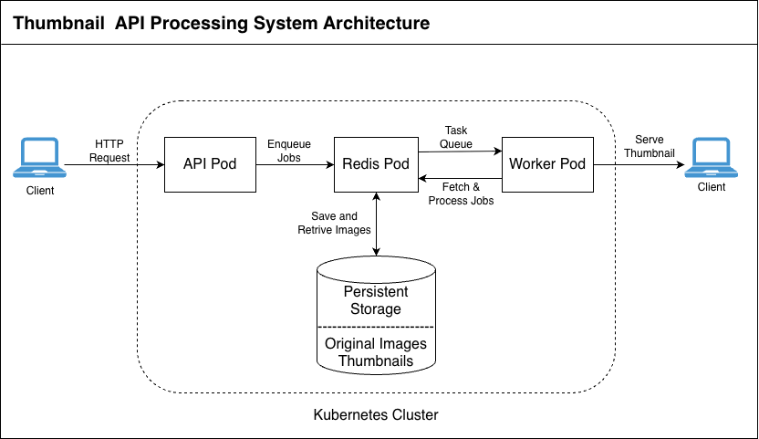

### Author: Vaibhav Bhagwan Chidrawar

# Thumbnail API
This project implements a long-running, asynchronous image processing API using FastAPI, Redis (RQ), Docker, Helm, and Kubernetes (kind).

## Architecture Overview and technologies used

A Job **Queue + Worker** architecture was chosen to support long-running and asynchronous image processing tasks.
- Keeps API responsive
- Decouples request handling from heavy processing
- Easily scalable by adding more workers

### 1. FastAPI (API Service)
- High performance and async support
- Automatic OpenAPI documentation
- Simple and readable code structure

### 2. Redis + RQ
- Lightweight and reliable job queue
- Easy to integrate with Python
- Suitable for background jobs without introducing heavy dependencies

### 3. Shared Persistent Storage
- Ensures both API and worker can access original images and thumbnails
- Simple and effective for a single-cluster setup and local development environments

## Architecture Diagram and Components 
Please refer to the following architecture diagram.



The system includes following components.

### 1. API Service
- Accepts image uploads
- Enqueues thumbnail generation jobs
- Provides job id and status

### 2. Worker Service
- Consumes jobs from Redis
- Generates thumbnails asynchronously

### 3. Redis
- Acts as the job queue backend (RQ)
- Also stores job metadata

### 4. Persistent Storage
- Original images and generated thumbnails are stored on a shared Persistent Volume Claim (PVC)

## Why Above Architecture

This architecture aligns with the requirements mentioned in the "Cogent Labs Platform Infrastructure Engineer Assignment Thumbnail API" document.

#### 1. Long-running job support
Image processing is handled asynchronously via a job queue, ensuring the API remains responsive even for time-consuming tasks.

#### 2. Scalability
Workers can be scaled horizontally to process multiple jobs in parallel without changing the API layer.

#### 3. Reliability and Fault Tolerance
Redis maintains job state, allowing recovery in case of worker failures.

#### 4. Clear Separation of Concerns
- API: request handling and orchestration
- Worker: CPU-intensive processing
- Redis: job coordination
- Storage: persistent data management

#### 5. Future Extensibility
The same job queue and worker model can support additional image processing tasks beyond thumbnail generation.

### High-Level Application Flow
1. Client uploads an image
2. API stores the original image
3. API enqueues a job in Redis
4. Worker processes the job and generates a thumbnail
5. Client polls the job status
6. Client fetches the generated thumbnail

Here are the componenets/tools/technologies used,

| Component/Tools/Technology |   Description         |
| --------- | -------------------------------------- |
| FastAPI   | REST API for job and worker processes  |
| RQ        | Background job queue                   |
| Redis     | Queue backend & job metadata store     |
| Docker    | Containerization                       |
| Helm      | Kubernetes packaging                   |
| kind      | Local Kubernetes cluster               |

## How to Install Application in Kubernetes [Kind]

### 1. Build Docker Images Locally
```
docker build -t thumbnail-api:v1.1 -f Dockerfile.api .
docker build -t thumbnail-worker:v1.1 -f Dockerfile.worker .
```

### 2. Create Kubernetes Kind Cluster
```
kind create cluster --name thumbnail

# Confirm Cluster creation
kubectl get nodes
```

### 3. Load local images into node
```
kind load docker-image thumbnail-api:v1.1 --name thumbnail
kind load docker-image thumbnail-worker:v1.1 --name thumbnail
```

### 4. Install Application [Deploy Helm Chart]
```
helm install thumbnail ./charts/thumbnail-api

# Confirm deployment using following command
helm list
```

### 5. Access the API (port-forward)
```
kubectl port-forward svc/thumbnail-api 8000:8000
```

### 6. Test the Application Health
```
curl http://localhost:8000/health
```

## Debugging Commands

### 1. Verify Kubernetes Resources Creation
```
kubectl get all -n <namespace>
kubectl get pods
kubectl get svc
kubectl get pvc
```

### 2. Pods and their Status
```
kubectl describe pod <pod-name>
kubectl logs <pod-name>
kubectl logs <pod-name> -c <container-name>
kubectl exec -it <pod-name> -- /bin/sh
```

### 3. Redis/Job Queue Debugging
```
kubectl exec -it <redis-pod-name> -- redis-cli
PING
MONITOR
```

### 4. Storage Debugging
```
kubectl describe pvc
kubectl get pv
```

### 5. Helm Debugging
```
helm history thumbnail
helm upgrade thumbnail ./charts/thumbnail-api
helm rollback thumbnail <revision>
helm uninstall thumbnail
```

## API Documentation

### 1. Health Check: GET /health
Health endpoint to verify that the API process is running.
```
# Example
curl http://localhost:8000/health

# Response
{
  "status": "ok"
}

```

### 2. Upload Image: POST /jobs
Uploads an image and enqueues a thumbnail generation job.
```
# Example
curl -X POST -F "file=@image1.png" http://localhost:8000/jobs/

# Response
{
  "job_id": "af46159b-3371-430d-b0ed-e02007f6d2ce",
  "status": "queued"
}
```

### 3. Get Job Status: GET /jobs/{job_id}
Returns the current status of a submitted job.
```
# Example
curl http://localhost:8000/jobs/af46159b-3371-430d-b0ed-e02007f6d2ce

# Response
{
  "job_id": "af46159b-3371-430d-b0ed-e02007f6d2ce",
  "status": "succeeded"
}
```
**Possible Job Status Values**
- queued
- processing
- succeeded
- failed

### 4. List All Jobs: GET /jobs
Lists all known jobs with current status.
```
# Example
curl http://localhost:8000/jobs/

# Response
[
  {
    "job_id": "af46159b-3371-430d-b0ed-e02007f6d2ce",
    "status": "processing"
  },
  {
    "job_id": "d6de0a7c-cc0f-4354-8ff3-5882df635503",
    "status": "succeeded"
  }
]
```

### 5. Download Generated Thumbnail: GET /jobs/{job_id}/thumbnail
```
# Example
curl http://localhost:8000/jobs/af46159b-3371-430d-b0ed-e02007f6d2ce/thumbnail --output thumbnail.png
```

### 6. Job Debug Endpoint [Bonus for Debugging]: GET /jobs/{job_id}/debug
```
# Example
curl http://localhost:8000/jobs/af46159b-3371-430d-b0ed-e02007f6d2ce/debug

# Response
{
    "status":"succeeded",
    "rq_job_id":"b27b17a7-9fa5-4b9f-8cf4-d98263636baa",
    "created_at":"1766333733.7553065",
    "started_at":"1766333733.7891757",
    "finished_at":"1766333763.8207152",
    "processing_time_ms":"30031"
}
```
**Usage**
- Incident debugging
- Verifying job state transitions
- Job processing time verification

**Note:** Debug endpoint is intended for internal use only and should be
restricted or removed in production environments.

## Trade-offs
1. Minimal and simple architecture with a single worker for clarity and ease of reasoning.
2. Local filesystem storage (PVC) used instead of object storage to reduce complexity.
3. Authentication and authorization omitted.
4. No retry logic - Failed jobs are marked as failed without retry logic. 
5. Limited observability — Need more Prometheus, Application Metrics.
6. Basic image validation only.
7. Security & Hardening - RBAC, various permission etc.

## Things to consider before Productionize the system
If this system were to be fully productionized, the following improvements would be addressed:

### 1. Deployment
- Deploy services on Kubernetes with:
  - Separate Deployments for API and Worker
  - Independent scaling policies
- Use Helm for various environments (dev / staging / prod)

### 2. Scalability
- Horizontal Pod Autoscaling (HPA):
  - Scale API pods based on request rate or latency
  - Scale worker pods based on Redis queue depth

### 3. Reliability
- Run Redis in high-availability mode. Replication and persistence enabled
- Use readiness and liveness probes to check healthiness of pods.

### 4. Observability
- Add various application Metrics
- Structured logs with correlation IDs (job_id)
- Implement Alerting

### 5. Storage
- Replace shared PVC with object storage [S3-compatible storage]
- Implement storage policies, auto clean old images and thumbnails
- Monitor the Storage.

### 6. Security
- Enforce API authentication and authorization
- Store secrets securely using Kubernetes Secrets or external secret managers

